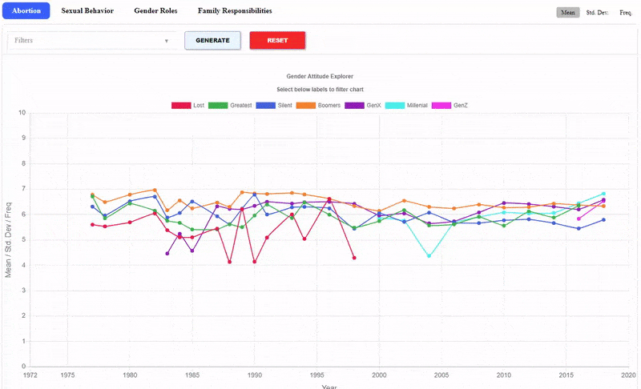
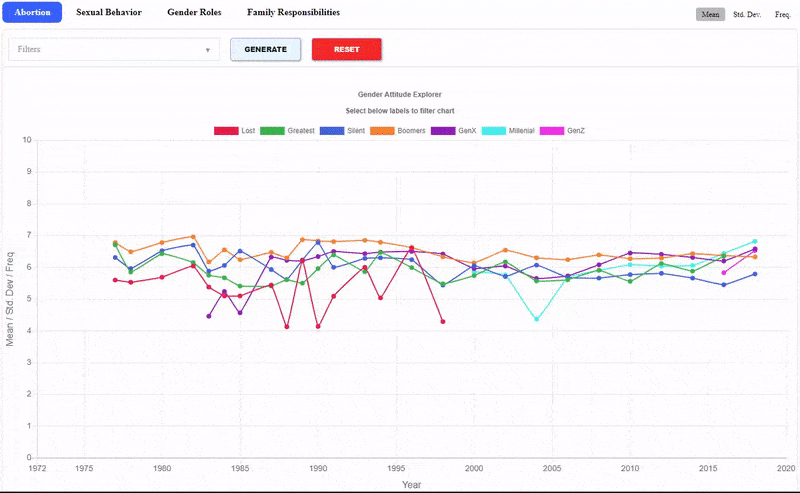
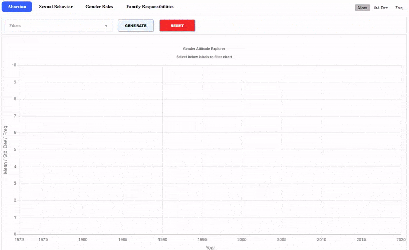
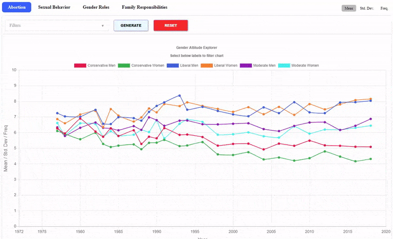

# Looking for the Gender Attitude Explorer Tool? [Click here!](https://anon-socius.github.io/Anonymous-Gender-Attitudes-Explorer/)

## [Appendices] Gender Attitudes by Generation

### Table of Contents 

0. [Notes, Software, and Dependencies](#0-notes-software-and-dependencies)

1. [Gender Attitude Explorer Tool (GAET)](#1-gender-attitude-explorer-tool-gaet)  
	a. [What is GAET](#a-what-is-gaet)  
	b. [How to use GAET](#b-how-to-use-gaet)  
	c. [GAET Code Base](#c-gaet-code-base)  


2. [Dependent Variables](#2-dependent-variable-question-phrasing)  
	a. [Abortion Attitudes Question Phrasing](#a-abortion-attitudes-question-phrasing)  
	b. [Sexual Behavior Attitudes Question Phrasing](#b-sexual-behavior-attitudes-question-phrasing)  
	c. [Political Gender Roles Attitudes Question Phrasing](#c-political-gender-roles-attitudes-question-phrasing)  
	d. [Family Responsibilities Attitudes Question Phrasing](#d-family-responsibilities-attitudes-question-phrasing)  
	
3. [Attitude Scale Construction](#3-attitude-scale-construction)    

<hr>

#### 0. Notes, Software, and Dependencies

1. All computational analysis was done using [Stata](https://www.stata.com/).    
2. All data visualization was done using [Chart.js](https://www.chartjs.org/).    
3. README.md file created using [Markdown Preview](https://github.com/facelessuser/MarkdownPreview), created and maintained by [Isaac Muse](https://github.com/facelessuser).
4. Attitude Charts use dependent variables that have been rescaled to range from 0 to 10. For a complete explanation of how scaling works, see [here](#3-attitude-scale-construction).
5. Generations were coded using the follow birth-year ranges:
```
    Lost Generation:  1890 - 1909
Greatest Generation:  1910 - 1927
  Silent Generation:  1928 - 1945
            Boomers:  1946 - 1964
       Generation X:  1965 - 1980
         Millenials:  1981 - 1996
       Generation Z:  1997 - 2012
``` 

<hr>

#### 1. Gender Attitude Explorer Tool (GAET)

To use GAET, please click [here](https://anon-socius.github.io/Anonymous-Gender-Attitudes-Explorer/)

##### a. What is GAET

[GAET](https://anon-socius.github.io/Anonymous-Gender-Attitudes-Explorer/) is a tool we developed to (1) encourage interaction with the data and (2) expedite the process of creating compact data visualizations for projects with many datasets.
In this instance, we have generated gender attitude trend lines in four domains: Abortion, Sexual Behavior, Political Gender Roles, and Family Responsibilities. These trends lines reflect the mean, standard deviation, and frequency of GSS respondent data from 1973 to 2018. Additionally, the trend lines may be filtered by generation, gender, and political alignment. Using this tool, we are easily able to quickly generate visualizations of *N* trend lines:  

```
N = (Num demographic groups)! × (Num demographic subgroups) × (Num Domains) × (Statistic Types)
```
In this visualization, there are a total of:
```  
 3  Demographic Groups (Political views, Gender, and Generation)  
12  Demographic subgroups (Conservative, Liberal, Moderate, Men, Women, Lost Gen., Millenials, etc.)  
 4  Domains (Abortion, Sexual Behavior, Political Gender Roles, and Family Responsibilities)  
 3  Statistic Types (Mean, Standard Deviation, Frequency)  
```   

In total, this dataset produces 1,152 distinct trend lines  
```
1,152 = 3! × 12 × 4 × 3  
```
However, it would be simple to add another demographic group resulting in access to thousands of additional trend lines. For example, an additional Demographic Group that contains 5 additional subcategories, such as Religion, would result in 4,896 trend lines:  
```
4,894 = 4! x 17 x 4 x 3  
```
##### b. How to use GAET

1) To plot trend lines, select the desired domain and statistic type, found at the top of the tool:

<br>



<br>

2) Clear the chart's contents by clicking the *Reset* button. Add lines by selecting items in the filter and then: Add lines by selecting items in the Filter and then clicking the *Generate* button:

<br> 



<br>

3) Filters can be selected from multiple demographics for cross-sectional breakdowns:  

<br>



<br>

4) Trend lines may be toggled on and off by clicking on legend keys:

<br>




##### c. GAET Code Base

This tool can be quickly repurposed to display any summary statistic trends. A link to the code base can be found [here](./do/GAET.zip).

<hr>

#### 2. Dependent Variable Question Phrasing

##### a. Abortion Attitudes Question Phrasing  
1. Please tell me whether or not you think it should be possible for a pregnant woman to obtain a legal abortion if the family has a very low income and cannot afford any more children? (**GSS Variable:** [abpoor](https://gssdataexplorer.norc.org/variables/604/vshow))  

2. Please tell me whether or not you think it should be possible for a pregnant woman to obtain a legal abortion if the woman's own health is seriously endangered by the pregnancy? (**GSS Variable:** [abhlth](https://gssdataexplorer.norc.org/variables/603/vshow))  

3. Please tell me whether or not you think it should be possible for a pregnant woman to obtain a legal abortion if she is married and does not want any more children? (**GSS Variable:** [abnomore](https://gssdataexplorer.norc.org/variables/602/vshow))  

4. Please tell me whether or not you think it should be possible for a pregnant woman to obtain a legal abortion if there is a strong chance of serious defect in the baby? (**GSS Variable:** [abdefect](https://gssdataexplorer.norc.org/variables/601/vshow))  

5. Please tell me whether or not you think it should be possible for a pregnant woman to obtain a legal abortion if she became pregnant as a result of rape? (**GSS Variable:** [abrape](https://gssdataexplorer.norc.org/variables/605/vshow))  

6. Please tell me whether or not you think it should be possible for a pregnant woman to obtain a legal abortion if she is not married and does not want to marry the man? (**GSS Variable:** [absingle](https://gssdataexplorer.norc.org/variables/606/vshow))  

7. Please tell me whether or not you think it should be possible for a pregnant woman to obtain a legal abortion if the woman wants it for any reason? (**GSS Variable:** [abany](https://gssdataexplorer.norc.org/variables/607/vshow))  

##### b. Sexual Behavior Attitudes Question Phrasing

1. Would you be for or against sex education in the public schools? (**GSS Variable:** [sexeduc](https://gssdataexplorer.norc.org/variables/626/vshow))  

2. There's been a lot of discussion about the way morals and attitudes about sex are changing in this country. If a man and woman have sex relations before marriage, do you think it is always wrong, almost always wrong, wrong only sometimes, or not wrong at all? (**GSS Variable:** [premarsx](https://gssdataexplorer.norc.org/variables/631/vshow))  

3. Questions associated with this variable: There's been a lot of discussion about the way morals and attitudes about sex are changing in this country. If a man and woman have sex relations before marriage, do you think it is always wrong, almost always wrong, wrong only sometimes, or not wrong at all? A. What if they are in their early teens, say 14 to 16 years old? In that case, do you think sex relations before marriage are always wrong, almost always wrong, wrong only sometimes, or not wrong at all? (**GSS Variable:** [teensex](https://gssdataexplorer.norc.org/variables/632/vshow))  

4. What about sexual relations between two adults of the same sex--do you think it is always wrong, almost always wrong, wrong only sometimes, or not wrong at all? (**GSS Variable:** [homosex](https://gssdataexplorer.norc.org/variables/634/vshow))   

5. What is your opinion about a married person having sexual relations with someone other than the marriage partner--is it always wrong, almost always wrong, wrong only sometimes, or not wrong at all? (**GSS Variable:** [xmarsex](https://gssdataexplorer.norc.org/variables/633/vshow))  

##### c. Political Gender Roles Attitudes Question Phrasing  
1. Tell me if you agree or disagree with this statement: Most men are better suited emotionally for politics than are most women. (**GSS Variable:** [fepol](https://gssdataexplorer.norc.org/variables/591/vshow))  

##### d. Family Responsibilities Attitudes Question Phrasing  
Now I'm going to read several more statements. As I read each one, please tell me whether you strongly agree, agree, disagree, or strongly disagree with it. For example, here is the statement:  

1. A working mother can establish just as warm and secure a relationship with her children as a mother who does not work. (**GSS Variable:** [fechld](https://gssdataexplorer.norc.org/variables/703/vshow))  

2. A preschool child is likely to suffer if his or her mother works. (**GSS Variable:** [fepresch](https://gssdataexplorer.norc.org/variables/705/vshow))  

3. It is much better for everyone involved if the man is the achiever outside the home and the woman takes care of the home and family. (**GSS Variable:** [fefam](https://gssdataexplorer.norc.org/variables/706/vshow))  

#### 3. Attitude Scale Construction

Attitude scores are calculated for each respondent based on their GSS response to the questions in the dependent variables section above. As an example, the abortion scale is comprised of 7 yes or no questions. For each question a respondent answers with a view that is in support of abortion, they are assigned a point. **For example:**  

If a respondent answers 5 out of 7 abortion attitude questions in support of abortion, they score 5 points on the abortion scale. That score is then divided by the total number of questions in the scale divided by 10, in order to rescale all scores to fall into a standard 0 to 10 range. In this case, because there are 7 questions, the respondent's score would be divided by 0.7, resulting in a final score of approximately 7.143.  

Any respondent who chose not to answer a question or gave a non-answer response such as "I don't know" is dropped from the scale of which they gave the non-answer. Other respondents, such as oversampled groups, are also excluded, so as to reflect more representative attitude scores.  

The code to create, sort, and filter the scales for this project can be found [here](./do/1_new_variable_filter.do).  
